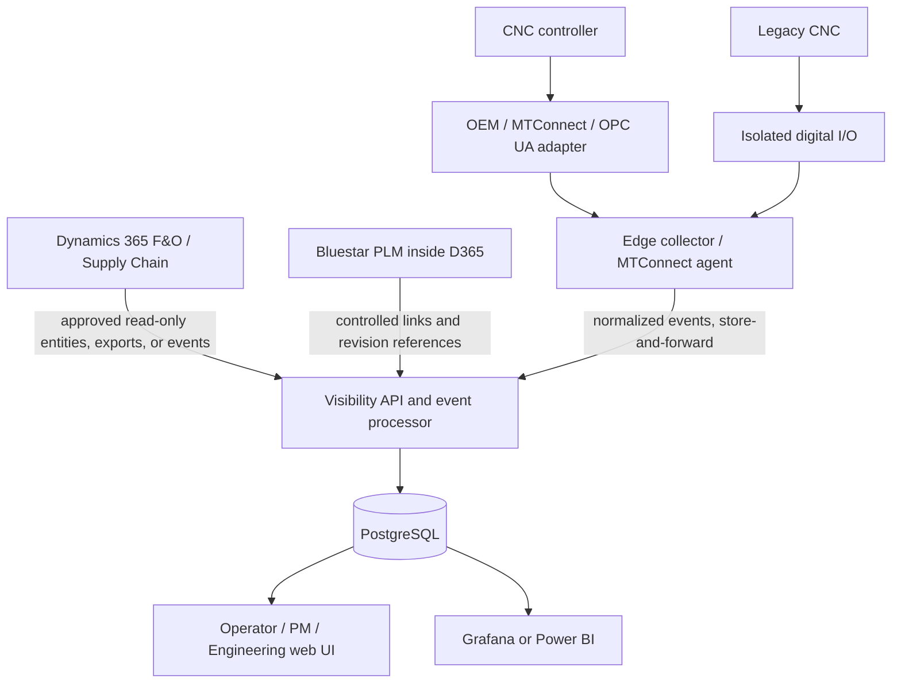

# System Architecture

## Pattern

Use a sidecar architecture. Dynamics 365 and Bluestar remain authoritative. The new service ingests approved read-only business references and machine telemetry, correlates them, and presents task-specific views.

## Components

### Edge collector

- Connects to machine adapters, OPC UA endpoints, or I/O
- Preserves source timestamps
- Maps raw tags into a small normalized state model
- Buffers events during central-server outages
- Reports connection health
- Does not command the machine

### Central application

- Associates machine events with work orders
- Converts event transitions into state intervals
- Prompts for human context after configurable delay thresholds
- Manages blockers and audit history
- Calculates ETA ranges and confidence
- Exposes authenticated APIs and browser views

### Database

- Stores raw events, normalized events, intervals, work-order references, blocker history, and audit records
- Does not become the authoritative store for official D365/Bluestar records

## Normalized machine states

- `OFF`
- `UNAVAILABLE`
- `READY`
- `PRODUCTION`
- `SETUP`
- `STOPPED`
- `FAULT`
- `PLANNED_DOWNTIME`
- `UNKNOWN`

Raw source values must be retained for troubleshooting and auditability.

## Recommended software stack

- Python/FastAPI API
- PostgreSQL database
- React/TypeScript browser interface
- Grafana or Power BI dashboards
- Docker Compose development/deployment
- Microsoft Entra ID when approved
- GitHub Actions for tests and build checks
