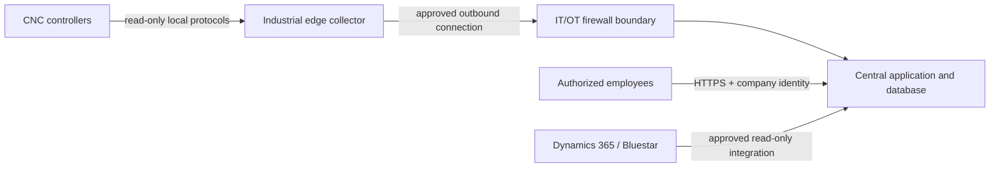

# Security and OT Networking

## Pilot requirements

- CNC access remains read-only
- CNC controllers are not exposed directly to the internet
- Use an IT-approved segmented OT VLAN or protected machine network
- Route data through an industrial edge computer with controlled outbound access
- Separate machine adapters from the public-facing application tier
- Use TLS for browser/API traffic
- Use company identity and least-privilege roles where approved
- Store credentials in an approved secret-management method, never in Git
- Log administrative, configuration, and manual data changes
- Back up the database nightly and test restoration
- Patch application dependencies and container images under change control

## Network pattern

## Prohibited practices

- Direct D365 database access
- Public internet access to machine controllers
- Personal cloud accounts or personal service credentials
- Machine-control commands from the visibility platform
- Connecting to emergency-stop or safety circuits
- Unreviewed remote-access software
- Committing customer data, controlled drawings, credentials, or production IP addresses

## Review ownership

IT/OT security owns network and identity approval. Manufacturing/controls engineering owns machine-signal approval. Business systems owns D365/Bluestar integration approval. The application owner maintains software, backups, and auditability.

Reference: NIST SP 800-82 Rev. 3, Guide to Operational Technology Security.
